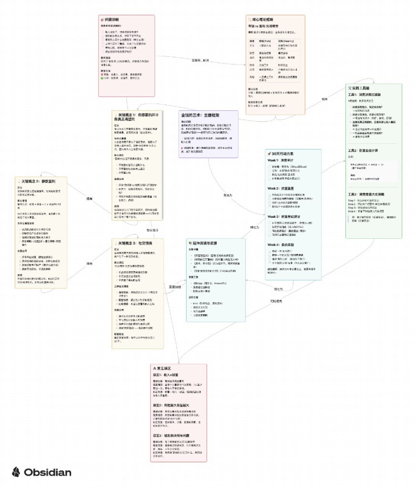

# Document to Canvas Skill - 主题式知识提取

将各种文档（PDF、EPUB、DOC、TXT）和网络文章转换为**主题驱动**的 Obsidian Canvas 思维导图。

**Author:** [Ryan Chen](https://x.com/fidoyeah)  
**Repository:** [github.com/fidoyeah/document-to-canvas](https://github.com/fidoyeah/document-to-canvas)

---

## 推荐模型（重要）

按作者实测，在「读长文 → 抽主题 → 生成合规 Obsidian `.canvas` JSON」这条链路上，**Kimi K2.5（`kimi-2.5`）** 表现**最好**（结构稳、表格与清单完整、更贴 `SKILL.md` 的象限布局）。

**同样支持其它模型**：Claude、GPT、Gemini、通义、DeepSeek 等只要具备长上下文与按规范输出 JSON 的能力，都可直接套用本仓库的 `SKILL.md` / `AGENTS.md`。若输出偏「按章节罗列」，请让模型对照 `AGENTS.md` 改为主题式节点与连线。

---

## 最简单用法（30 秒）

1. **用 AI 生成 Canvas（推荐）**  
   模型首选 **Kimi K2.5（`kimi-2.5`）**；其它模型亦可。把下面这一行丢给 **Cursor、Claude Code、CodeBuddy、小龙虾** 等任意能读网页的 Agent：

   > 请阅读仓库 **https://github.com/fidoyeah/document-to-canvas** 里的 `SKILL.md` 和 `AGENTS.md`，按其中的「主题式 Canvas」规范，把我提供的书籍/文章转成 Obsidian 可用的 `.canvas` JSON，并保存到我指定的路径（需包含 `书/` 或 `文章/` 子目录）。

2. **用本仓库的脚本（EPUB）**  
   先设置输出目录，再跑脚本：

   ```bash
   export DOCUMENT_TO_CANVAS_OUTPUT_BASE="/你的路径/Book Diagram"   # 其下应有 书/ 与 文章/
   python document_to_canvas.py /path/to/book.epub
   ```

   脚本当前对 EPUB 有示例逻辑；完整书目仍建议用上面的 AI + `SKILL.md` 工作流。

---

## 给 AI Agent 用：一行地址即可学习

把 **仓库根地址** 发给 Agent 即可，无需打包文件：

| 用途 | 发给 Agent 的内容 |
|------|-------------------|
| 学习规范 | `https://github.com/fidoyeah/document-to-canvas` — 请阅读 `SKILL.md`（结构与节点规范）、`AGENTS.md`（实现步骤）、必要时 `README.md`（示例与截图）。 |
| 只想要最短说明 | 同上链接 + 「按主题式思维导图输出 `.canvas` JSON，不要用章节罗列。」 |
| 模型选择 | **首选 Kimi K2.5（`kimi-2.5`）**；其它长上下文模型也可，规范相同。 |

Agent 若无法直接克隆，可让其打开 GitHub 上的上述 Markdown 原文。本仓库为 MIT，可自由复制 `SKILL.md` 进你自己的项目或 skills 目录。

---

## 输出在 Obsidian 里长什么样

下面是用本技能思路生成的 **`金钱的艺术_主题框架.canvas`** 在 Obsidian 中打开的效果：多色卡片、箭头与标签连接「问题诊断 → 理论框架 → 关键概念 → 实践工具 → 误区与行动」等关系，便于一眼把握全书骨架。



*上图为 **PNG 原图**（约 1748×2048，仓库内不转 JPEG、不做有损压缩）。README 里可能被缩略；若字小看不清，请 **[点此打开 GitHub 上的全尺寸原图](https://raw.githubusercontent.com/fidoyeah/document-to-canvas/master/docs/example-money-art-canvas-obsidian.png)**（新标签页查看更清晰）。*

*画面为真实 `.canvas` 在 Obsidian Canvas 中的呈现；卡片颜色与 `SKILL.md` 中的颜色编码一致。*

---

## 🎯 核心理念：从"章节罗列"到"主题提取"

### ❌ 传统章节导向
```
[中心] 书名
    ├─ [第一章] 引言
    ├─ [第二章] 概念A
    ├─ [第三章] 概念B
    └─ ... (读者迷失在结构中)
```

### ✅ 优化主题导向
```
                    [核心命题]
                          │
        ┌─────────────────┼─────────────────┐
        │                 │                 │
   [问题诊断]        [理论框架]        [实践工具]
        │                 │                 │
        └─────────────────┼─────────────────┘
                          │
   [常见误区] ──────── [行动方案] ──────── [延伸阅读]
```

## 📂 输出目录结构

将 `YOURPATH` 替换为你的本地目录（包含 `书` 与 `文章` 子文件夹）。也可通过环境变量 `DOCUMENT_TO_CANVAS_OUTPUT_BASE` 指定，无需改代码。

```
YOURPATH/
├── 书/                    # 书籍输出（主题框架）
│   └── [书名]_主题框架.canvas    # 例：金钱的艺术_主题框架.canvas
└── 文章/                  # 文章输出（核心洞见）
    └── [文章标题]_核心洞见.canvas
```

## 🏗️ Canvas结构（六大主题模块）

### 1. 核心命题（中心）
- 一句话概括全书价值主张
- 适用人群
- 预期效果

### 2. 问题诊断（左上）
- 读者现状自检清单
- 根本原因分析
- 旧思维 vs 新思维对比

### 3. 理论框架（右上）
- 核心模型/方法论
- 对比表格
- 应用公式

### 4. 关键概念（左侧）
- 3-5个核心概念
- 每个包含：定义、重要性、应用、案例、误解澄清

### 5. 实践工具（右中）
- 对话/邮件模板
- 检查清单
- 步骤指南

### 6. 常见误区（左下）
- 3个以上典型错误
- 错误认知 vs 现实情况
- 纠正方法

### 7. 行动方案（右下）
- 30天行动计划
- 每周具体任务
- 成功指标

### 8. 延伸阅读（底部）
- 关联书籍
- 工具资源
- 进阶主题

## 📖 示例：《金钱的艺术》主题框架

以下与仓库中同名思路一致，对应输出文件 **`金钱的艺术_主题框架.canvas`**（置于 `YOURPATH/书/`）。上图即为该文件在 Obsidian 中的视觉效果。

### 核心命题
金钱的真正价值不在于购买物品，而在于购买自由、时间和选择权。理财的目标不是变得「有钱」，而是变得「富裕」——拥有对自己生活的掌控权。

**适用人群：** 追求财务自由者、消费困惑者、理财入门者  
**预期效果：** 建立健康的金钱观，减少不必要消费，提升生活满意度

### 理论框架：有钱 vs 富裕（摩根·豪泽尔）

| 维度 | 有钱 (Rich) | 富裕 (Wealthy) |
|------|-------------|----------------|
| 定义 | 当前收入高 | 未被花掉的钱买到的自由 |
| 状态 | 被金钱控制 | 掌控金钱 |
| 消费 | 高消费维持形象 | 低消费，高储蓄 |
| 时间 | 为钱工作 | 时间自主 |
| 压力 | 需要取悦他人 | 不需要向任何人证明 |
| 风险 | 一旦停止工作就崩溃 | 拥有独立财务基础 |

**核心公式：** 富裕 = 未被花掉的钱 + 时间自主 + 不需要取悦任何人；**财富** = 收入 - 欲望（而非收入本身）。

### 关键概念
1. **你想要的并非你真正渴望的** — 区分地位消费与内在满足；「如果没有观众，我还会买吗？」
2. **静默复利** — 时间优于收益率；简单策略 + 长期坚持优于频繁操作。
3. **社交债务** — 身份债务、期望债务、比较债务；真正的富裕是可以对社交压力说「不」。

### 实践工具
- **消费决策过滤器**：四问法则（无观众是否仍买、自由还是负债、真需要还是给别人看、一年后是否后悔）
- **财富自由计算**：年支出 × 25（4% 提取率）
- **满意度最大化策略**：按「单位幸福感/元」排序支出、砍掉低效项

### 常见误区
1. **收入 = 财富** — 控制欲望往往比单纯加薪更重要。  
2. **风险越大收益越大** — 简单、长期、稳健 + 时间，往往更可靠。  
3. **钱能解决所有问题** — 物质之外还有关系、健康与意义。

### 行动方案（30 天概要）
- **Week 1 消费审计**：记账、区分必要/想要/社交压力、识别社交债务型消费。  
- **Week 2 欲望重置**：后悔清单、情绪触发、24 小时冷静期、不花钱的快乐来源。  
- **Week 3 财富基础**：财务自由数字、自动储蓄、简化投资、砍掉冗余订阅。  
- **Week 4 自由实验**：无消费日、拒绝一次社交压力消费、「隐形富裕」体验、写下「足够」的标准。

---

## 🔧 更多用法

### 配置输出路径

1. **环境变量（推荐）**：设置 `DOCUMENT_TO_CANVAS_OUTPUT_BASE` 为包含 `书/` 与 `文章/` 的目录绝对路径。
2. **修改默认值**：在 `document_to_canvas.py` 中将 `YOURPATH` 替换为你的路径。

### 方法1：AI 助手（与「最简单用法」一致）

```
用户：将 /path/to/book.epub（或全文/笔记）按 document-to-canvas 的 SKILL.md 转为主题式 canvas

AI 执行：
1. 阅读 https://github.com/fidoyeah/document-to-canvas 中 SKILL.md / AGENTS.md
2. 深度分析内容，提取核心命题、理论框架、关键概念
3. 提取实践工具、常见误区、30 天行动方案与延伸阅读
4. 生成 Obsidian JSON 并保存为 YOURPATH/书/[书名]_主题框架.canvas
```

### 方法2：Python 脚本
```bash
# 转换书籍（主题式，默认）
python document_to_canvas.py /path/to/book.epub --book

# 转换文章（主题式）
python document_to_canvas.py https://example.com/article --article
```

### 方法3：程序化调用
```python
from document_to_canvas import document_to_canvas_theme_based

output_path = document_to_canvas_theme_based('/path/to/book.epub', is_book=True)
print(f"主题框架已保存: {output_path}")
```

## 📋 内容提取方法论

### 第一步：识别核心命题
- 如果全书只能记住一句话，是什么？
- 作者最想改变读者的什么认知？
- 这本书与同类书的本质区别？

### 第二步：寻找理论框架
- 对比表格（A vs B）、流程/步骤、层级结构、关键术语与定义

### 第三步：提取可操作方法
- 检查清单、模板、步骤、工具推荐

### 第四步：识别反常识观点
- 「大多数人认为…但事实是…」、与主流观点相反的结论

## ✅ 质量检查清单

### 内容质量
- [ ] 是否能用一句话概括核心命题？
- [ ] 是否识别了至少1个理论框架？
- [ ] 是否提取了3-5个关键概念？
- [ ] 每个概念是否包含定义、应用、案例？
- [ ] 是否提供了立即可用的工具模板？
- [ ] 是否指出了3个以上常见误区？
- [ ] 是否有具体的30天行动方案？

### 结构质量
- [ ] 节点之间是否有逻辑关联（非简单罗列）？
- [ ] 连接线是否展示了因果关系？
- [ ] 是否适合快速浏览（标题清晰）？
- [ ] 是否便于实践应用（有checklist）？

## 🎨 颜色编码

| 颜色 | 用途 |
|------|------|
| 紫色 ("6") | 核心命题（中心） |
| 红色 ("1") | 问题诊断、常见误区 |
| 橙色 ("2") | 理论框架 |
| 黄色 ("3") | 关键概念 |
| 绿色 ("4") | 实践工具 |
| 青色 ("5") | 行动方案、延伸阅读 |

## 💡 最佳实践

1. **深度优于广度**：宁可深挖3个概念，不要罗列10个章节
2. **连接胜于堆砌**：展示概念间的因果关系
3. **行动胜于认知**：每个理论都配套实践方法
4. **反直觉优于常识**：突出颠覆性观点
5. **视觉化优于文字**：使用表格、清单、流程图
6. **用户中心**：始终问"读者能用它来做什么？"

## 📁 Skill文件结构

```
document-to-canvas/
├── SKILL.md                  # 完整技能文档
├── AGENTS.md                 # 实现指南
├── document_to_canvas.py     # Python脚本
├── docs/
│   └── example-money-art-canvas-obsidian.png  # Obsidian 中打开 .canvas 的示例截图
├── README.md                 # 本文件
└── LICENSE                   # MIT
```

## 🔍 对比：旧版 vs 新版

| 维度 | 旧版（章节导向） | 新版（主题导向） |
|------|-----------------|-----------------|
| 结构 | 按章节罗列 | 按主题组织 |
| 节点数 | 14个 | 10个（更精炼） |
| 核心 | 展示内容结构 | 展示思想体系 |
| 用途 | 了解章节分布 | 快速掌握核心 |
| 实践性 | 低 | 高（含工具、清单） |
| 适用场景 | 回顾全书 | 学以致用 |

## 📝 更新日志

### v2.0 - 主题式重构
- 从章节导向转变为理论/框架导向
- 新增问题诊断、常见误区、行动方案模块
- 强调学以致用，提供可执行工具
- 优化连接线逻辑，展示因果关系

### v1.0 - 初始版本
- 基于章节结构的思维导图
- 简单的节点罗列

## 📄 License

MIT License — see [LICENSE](LICENSE).
